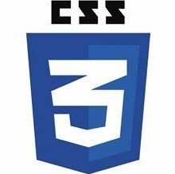

  
  

 

<h2>I'm a software developer who develops himself and follows new technologies</h2>

<h3>About me;</h3>

- 💼 FrontEnd Engineer
-  I love writing code
- 💬 Ask me about anything to fulldevstudios@gmail.com

- LinkedIn : https://www.linkedin.com/in/ebubekir-nazli-13esn/
- To be able to see my designs ;
- Dribbble : https://dribbble.com/devebu
<h3 align="left">Languages and Tools:</h3>

  
  
  
  
  
   
    
  
  
  
  
  
  
  
  
  

	
  
<b><h3>About me;</h3></b>
 

