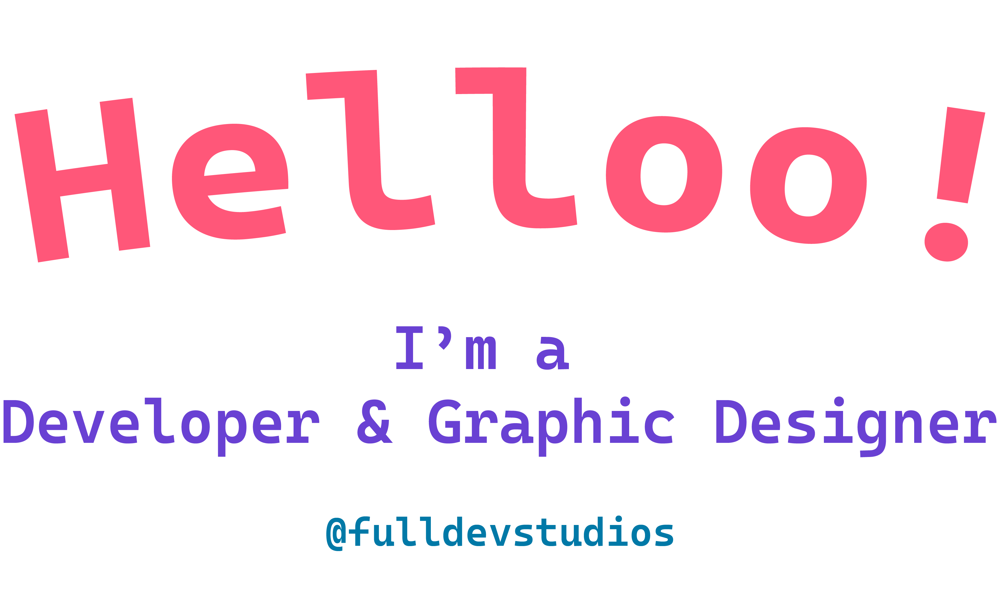

  
  

  
# Hi! 👋 I'm Ebubekir! 

I'm a software developer who develops himself and follows new technologies

## About Me

- 💼 FrontEnd Developer
-  I'm always excited to write code
- 📫 You can contact me at: fulldevstudios@gmail.com
- 🌐 You can connect with me on [LinkedIn](https://www.linkedin.com/in/ebubekir-nazli-13esn/)
- 🎨 Check out my designs on [Dribbble](https://dribbble.com/devebu)

## Technologies and Tools

